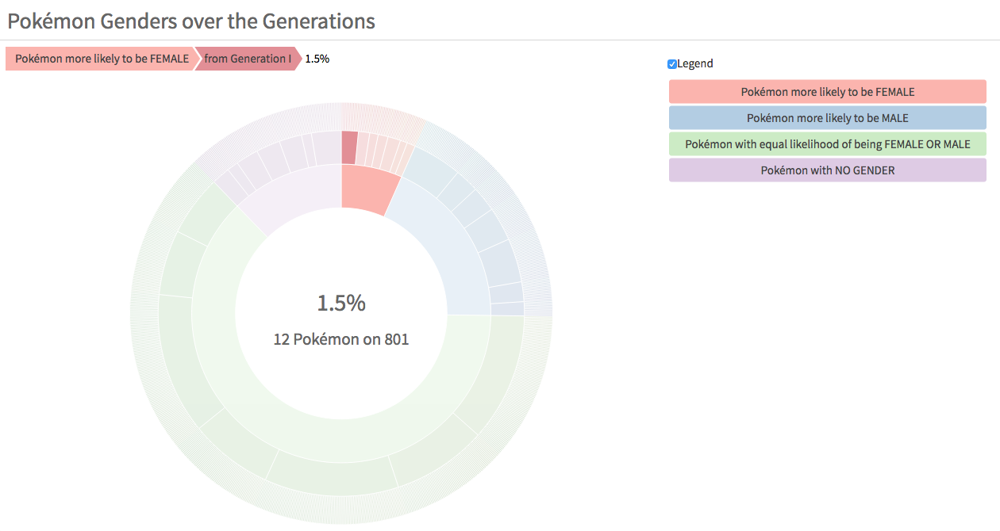

# Data Is Beautiful DataViz Challenge

My submission for the r/dataisbeautiful Data Viz Battle of September 2018:

- An [Interactive Gender Analysis of the Pokémon Universe](https://lgnbhl.github.io/dataisbeautiful/pokemon_genders.html) made with R and D3.js.

