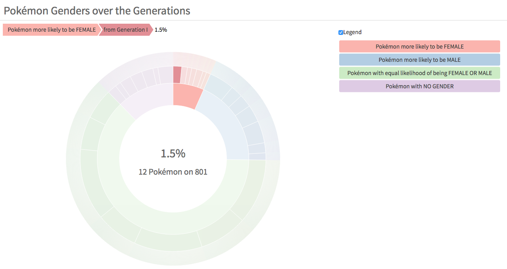

# Data Is Beautiful DataViz Challenge

My submission for the r/dataisbeautiful Data Viz Battle of September 2018:

- An interactive vizualization of [Pokemon genders over the generations](https://lgnbhl.github.io/dataisbeautiful/pokemon_genders.html), made with R and d3.js.

